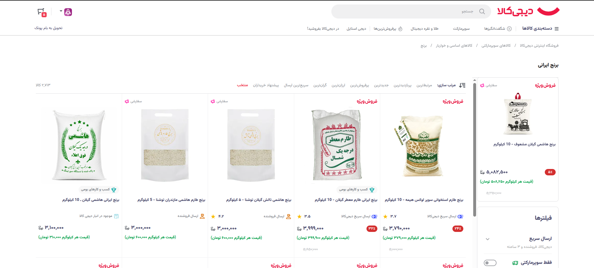
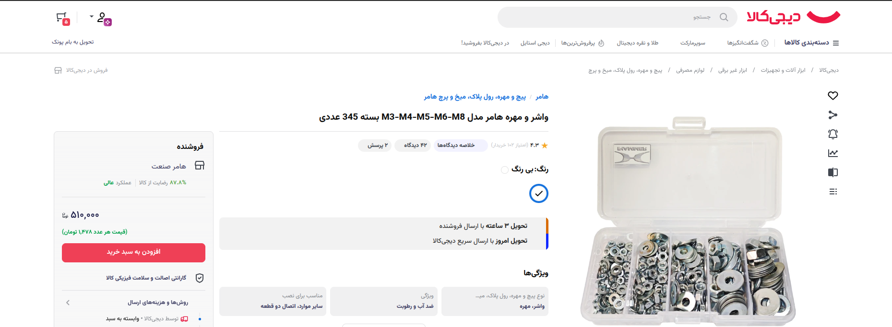
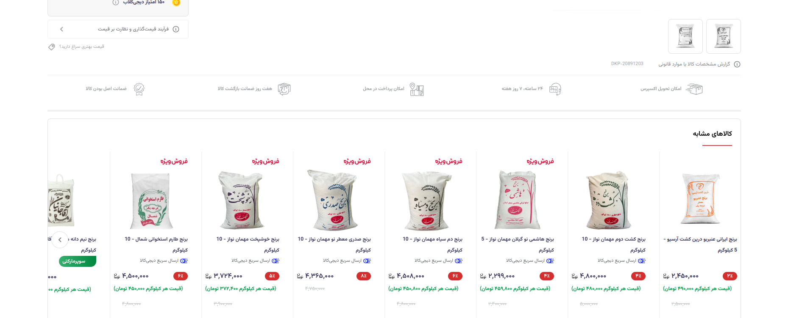

# 🛒 Digikala Unit Price Injector

A Tampermonkey userscript that automatically calculates and displays the price per unit (e.g., per piece, per kg, per liter) for bundled products on Digikala.com. It helps you find the actual value of multi-pack items at a glance.

---

## 📸 Screenshots

Here is how the script enhances the Digikala shopping experience:

### 1. Product Listing Page (PLP)
Displays the calculated unit price directly on the product cards in search results and category pages.

  

### 2. Product Detail Page (PDP)
Injects the unit price right below the final price inside the product's buy box.

  
  

---

## ✨ Features

- **Broad Page Support:** Works seamlessly on both Product Listing Pages (PLP) and Product Detail Pages (PDP).
- **Smart Number Extraction:** Accurately extracts quantities using regular expressions, preventing false positives from model numbers or dimensions (e.g., "T1" or "35x35").
- **Persian Compound Words Support:** Understands numeric words (e.g., "ده عددی", "نیم کیلو") and converts them to numbers for calculation.
- **Dynamic Loading Ready:** Uses `MutationObserver` to ensure unit prices are calculated even when products are loaded dynamically (infinite scrolling or Single Page Application navigation).
- **Standardized Units:** Normalizes various unit formats (e.g., "سی سی", "میلی لیتری", "بسته") into clean, readable outputs.

## 🚀 Installation

1. Install a userscript manager extension for your browser:
   - [Tampermonkey](https://www.tampermonkey.net/) (Chrome, Edge, Safari, Firefox)
   - [Violentmonkey](https://violentmonkey.github.io/) (Chrome, Edge, Firefox)
2. Create a new script in your extension.
3. Copy the entire contents of the `digikala-unit-price.user.js` file and paste it into the editor.
4. Save the script (Ctrl+S or Cmd+S).
5. Open or refresh [Digikala.com](https://dgkl.io/api/v1/Click/b/pcEUF?b64=aHR0cHM6Ly93d3cuZGlnaWthbGEuY29tLw==) to see it in action!

## ⚙️ How it Works

The script monitors the DOM for Digikala product cards and buy-box containers. Once detected, it extracts the product title and final price. By scanning the title for specific keywords and units (`regex` matching), it determines the total quantity in the package. Finally, it divides the total price by the quantity and injects a small, styled UI element indicating the price per unit.

### Supported Number Formats
- **Standard Digits:** `10`, `۱۲`, `1.5`, `۲٫۵`
- **Persian Words:** `یک`, `نیم`, `دوازده`, `صد و بیست`
- **Units:** `عدد`, `بسته`, `کیلوگرم`, `گرم`, `لیتر`, `میلی‌لیتر`, `متر`, `سانتی‌متر`, `سی‌سی` (along with their various suffixes).

## 📝 License

This project is open-source and available under the [MIT License](LICENSE).
